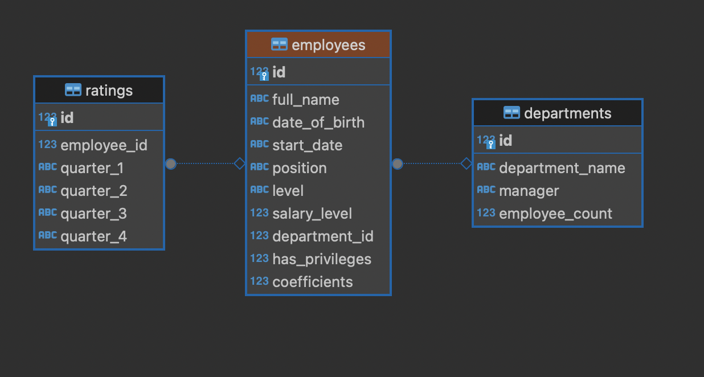

# employees_db

Данная лабораторная работа написан на языке Python  с использованием библиотеки SQLAlchemy  и Alembic для работы с миграциями 


## Структура БД



## Файлы проекта 

1. models.py 
2. database.py
3. query.py


## Models.py

В этом файле прописаны модели для БД


## Database.py

В этом файле прописаны функции для заполнения таблицы исходными данными 

## Query.py

В этом файле прописаны запросы к БД по заданию

## Алгоритм действий

1. Делаем первоначальную миграцию с помощью Alembic
```
alembic update fecc722df8f9
```
2. Запускаем файл database.py
3. Делаем вторую миграцию для добавления в таблицу Employees столбца coefficients
```
alembic update cc568ccce827
```
4. Запускаем файл query.py